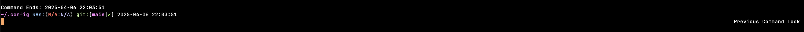

# TUI + ZSH + CLI Tool configuration

## Intended to use with
- zsh (macos native shell)
- [dotconfig](https://github.com/wcleeah/dotconfig)

## Prompt 
- [git-prompt](https://github.com/woefe/git-prompt)
- zsh native prompt time

## Plugins

# Installation
1. git clone this repo into .zsh/
2. git init and update all submodules
3. Run .zsh/installation.zsh
4. Run the manual config part if needed

## Exports
Add your exports under exports.zsh, it is ignored by git. The reason is based on different usage, plugins installed in different system can be vastly different

## Alias
All alias is managed under alias/, feel free to add / change the zsh files. A simple pull and re-source will sync the changes.
